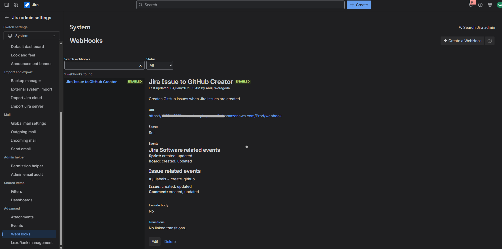
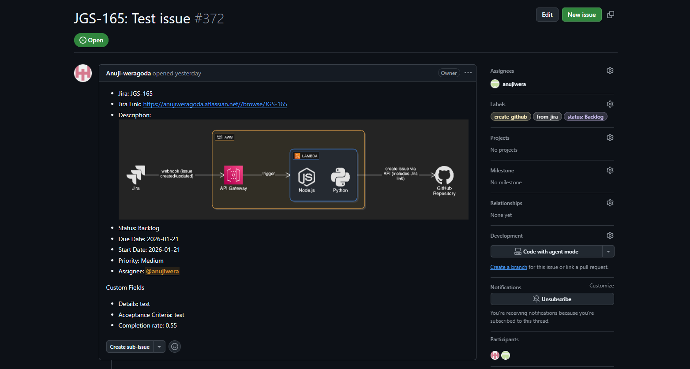

# *REPOSIROTYLINK : [https://github.com/Anuji-weragoda/jira-github-webhook.git](https://github.com/Anuji-weragoda/jira-github-webhook.git)*

# Jira to GitHub Issue Automation - Complete Setup & Configuration Guide

Welcome! This is the **complete guide** to set up and configure the Jira to GitHub webhook automation system. Follow this document from start to finish to get your system running.

---

## Table of Contents

1. [What This Project Does](#what-this-project-does)
2. [System Requirements](#system-requirements)
3. [Getting Started](#getting-started-5-10-minutes)
4. [Step-by-Step Setup](#step-by-step-setup)
5. [Configuration Reference](#configuration-reference)
6. [Troubleshooting](#troubleshooting)

---

## What This Project Does

This is a **serverless automation system** that:

- Automatically creates GitHub issues from Jira tickets
- Syncs issue details (title, description, acceptance criteria, attachments)
- Downloads and uploads images from Jira to GitHub
- Maps Jira labels to GitHub labels
- Uses secure webhook authentication with HMAC signature verification
- Runs on AWS Lambda with API Gateway (no servers to manage)

**How it works:**

1. You add a label (like `create-github`) to a Jira issue
2. Jira sends a webhook notification
3. Lambda function automatically creates a GitHub issue
4. GitHub issue contains all the Jira ticket details

---

## System Requirements

Before starting, make sure you have:

- **AWS Account** with permissions to create Lambda, API Gateway, and CloudFormation resources
- **AWS SAM CLI** installed (`sam --version`)
- **Node.js 18+** installed (`node --version`)
- **Docker** installed and running (`docker --version`)
- **Git** installed (`git --version`)
- **GitHub Account** with a repository where issues will be created
- **Jira Cloud Account** (this works with Jira Cloud only, not Server/Data Center)

### Verify Installation

```bash
sam --version          # Should show version
node --version         # Should show v18+
docker --version       # Should show Docker version
aws sts get-caller-identity  # Should show your AWS account
```

---

## Getting Started

### Step 1: Clone the Project

```bash
git clone <repository-url>
cd jira-github-webhook
npm install
```

### Step 2: Gather Required Credentials

You'll need these before deployment. Collect them now:

| Item                     | How to Get It                                                                                                                                | Save As            |
| ------------------------ | :------------------------------------------------------------------------------------------------------------------------------------------- | ------------------ |
| **GitHub Token**   | Go to https://github.com/settings/tokens → "Generate new token (classic)"→ Check `repo` and `admin:repo_hook` scopes → Copy the token | `GITHUB_TOKEN`   |
| **Jira API Token** | Go to https://id.atlassian.com/manage-profile/security/api-tokens → "Create API token"→ Copy the token                                     | `JIRA_API_TOKEN` |
| **Jira Email**     | The email address of your Jira account                                                                                                       | `JIRA_EMAIL`     |
| **Jira Base URL**  | Example:`https://your-company.atlassian.net/`(include the trailing slash)                                                                  | `JIRA_BASE_URL`  |
| **Webhook Secret** | Generate random string                                                                                                                       | `WEBHOOK_SECRET` |

### Step 3: Deploy the Application

Run the deployment command with your credentials:

```bash
sam deploy --guided
```

You'll be prompted for:

1. **Stack Name:** `jira-github-webhook`
2. **Region:** `us-east-1` (or your preferred AWS region)
3. **GitHubOwner:** Your GitHub username (e.g., `john-doe`)
4. **GitHubRepo:** Repository name (e.g., `my-project`)
5. **GitHubToken:** Paste your GitHub token
6. **JiraBaseUrl:** Your Jira URL (e.g., `https://company.atlassian.net/`)
7. **JiraEmail:** Your Jira email
8. **JiraApiToken:** Your Jira API token
9. **JiraWebhookSecret:** Your webhook secret
10. Other options: Press Enter to accept defaults, then answer:
    - "Allow SAM CLI IAM role creation": **y**
    - "Save parameters to samconfig.toml": **y**

### Step 4: Copy the API Endpoint

After deployment completes, look for output like:

```
Outputs:
  WebhookURL:
    Description: Webhook endpoint URL
    Value: https://xxxxxxxxxx.execute-api.us-east-1.amazonaws.com/Prod/webhook
```

**Copy this URL** - you'll need it in the next step.


### Step 5: Configure Jira Webhook

1. Go to your **Jira instance** → Settings (⚙️)
2. Navigate to **System** → **Webhooks**
3. Click **Create a WebHook** (or "Create webhook")
4. Fill in the form:
   - **Name:** `GitHub Integration`
   - **URL:** Paste the URL from Step 4
   - **Secret:** Paste your webhook secret
   - **Events:** Check ✓ Issue created, ✓ Issue updated
5. Click **Save** or **Create**

### Step 6: Test the Integration

1. Create a new **Jira issue** (Story, Task, or Sub-task)
2. Add the label: **`create-github`**
3. Go to your **GitHub repository** and check for a new issue
4. The GitHub issue should have the same title and description as the Jira issue

✅ **Success!** Your automation is working.

---

## Step-by-Step Setup

### Detailed AWS SAM Deployment

#### Option A: Interactive Guided Deployment (Recommended)

```bash
# From project root
sam build
sam deploy --guided
```

Follow the prompts and enter your credentials when asked.

#### Option B: Command-Line Parameters

```bash
sam build
sam deploy \
  --parameter-overrides \
    GitHubOwner=your-username \
    GitHubRepo=your-repo-name \
    GitHubToken=ghp_your_token_here \
    JiraBaseUrl=https://your-instance.atlassian.net/ \
    JiraEmail=your-email@example.com \
    JiraApiToken=ATATT_your_token_here \
    JiraWebhookSecret=your_webhook_secret \
  --capabilities CAPABILITY_IAM
```

#### Option C: Using samconfig.toml

Edit `samconfig.toml`:

```toml
[default.deploy.parameters]
parameter_overrides = [
  "GitHubOwner=\"your-username\"",
  "GitHubRepo=\"your-repo\"",
  "GitHubToken=\"ghp_your_token\"",
  "JiraBaseUrl=\"https://your-instance.atlassian.net/\"",
  "JiraEmail=\"your-email@example.com\"",
  "JiraApiToken=\"ATATT_your_token\"",
  "JiraWebhookSecret=\"your_webhook_secret\""
]
```

Then deploy:

```bash
sam build
sam deploy
```

### Configuring Jira Webhooks (Detailed)

1. **Access Jira Settings:**

   - Click your **profile icon** → **Settings**

     
2. **Navigate to Webhooks:**

   - Go to **System** → **WebHooks** (under Administration)
3. **Create Webhook:**

   - Click **Create a WebHook**
   - Fill in:
     - **Name:** `GitHub Integration`
     - **URL:** `https://xxxxxxxxxx.execute-api.us-east-1.amazonaws.com/Prod/webhook`
     - **Secret:** The webhook secret you generated
     - **Status:** Enabled
     - **Events:** Select:
       - ✓ Issue Created
       - ✓ Issue Updated
   - Click **Save**
4. **Verify:**

   - Webhook should show **Enabled** status
   - Click on it to see recent deliveries



---

## Configuration Reference

### Environment Variables (In template.yaml)

These are set during deployment and control how the system works:

#### Required Parameters (Provided at deployment)

| Parameter             | Description                               | Example                            |
| --------------------- | ----------------------------------------- | ---------------------------------- |
| `GitHubOwner`       | GitHub username or organization           | `john-doe`                       |
| `GitHubRepo`        | GitHub repository name                    | `my-project`                     |
| `GitHubToken`       | GitHub Personal Access Token              | `ghp_xxxxxxxxxxxxxxxxxxxx`       |
| `JiraBaseUrl`       | Your Jira instance URL (with trailing /)  | `https://company.atlassian.net/` |
| `JiraEmail`         | Jira account email                        | `user@example.com`               |
| `JiraApiToken`      | Jira API token                            | `ATATT3xFfGF0j...`               |
| `JiraWebhookSecret` | Secret for webhook signature verification | `a1b2c3d4e5f6...`                |

#### Optional Parameters (With defaults)

| Parameter         | Default                 | Description                                          |
| ----------------- | ----------------------- | ---------------------------------------------------- |
| `TriggerLabels` | `create-github`       | Labels that trigger issue creation (comma-separated) |
| `JiraTypes`     | `Story,Task,Sub-task` | Issue types to sync                                  |
| `LabelMapJson`  | Built-in mapping        | Maps Jira labels to GitHub labels                    |

### Changing Configuration After Deployment

To update parameters after initial deployment:

```bash
sam deploy \
  --parameter-overrides \
    TriggerLabels=create-github,sync-to-github \
    JiraTypes=Story,Task,Bug
```

Or use the AWS CloudFormation Console:

1. Go to **CloudFormation** → **Stacks** → `jira-github-webhook`
2. Click **Update** → **Edit template in designer**
3. Modify parameters and click **Update**

### Label Mapping Configuration

By default, Jira labels are mapped to GitHub labels as follows:

| Jira Label    | → | GitHub Label  |
| ------------- | -- | ------------- |
| bug           | → | bug           |
| feature       | → | enhancement   |
| documentation | → | documentation |
| etc.          | → | same label    |

To customize label mapping, modify the `LabelMapJson` parameter with a JSON object:

```json
{
  "bug": "bug",
  "feature": "enhancement",
  "documentation": "docs",
  "jira-label": "github-label"
}
```

### How Custom Fields Are Handled

**Custom fields from Jira are automatically included** in the GitHub issue. Here's how it works:

#### Automatic Field Discovery

The system automatically:

1. **Fetches all field mappings** from your Jira instance using your API token
2. **Maps field names to field IDs** (e.g., "Acceptance Criteria" → `customfield_10024`)
3. **Extracts all custom field values** from each Jira issue
4. **Displays them in the GitHub issue** in a "Custom Fields" section

#### What Gets Synced

✅ **Included in GitHub issues:**

- Title and description
- Status, priority, due date
- Start date (if custom field exists)
- Jira issue type and key
- All custom fields with values
- Assignee (with GitHub user mapping)
- Labels
- Attachments/images (stored in Releases)

#### Custom Field Display

All custom fields are displayed in the GitHub issue under the **"Custom Fields"** section:

```
- Jira: PROJ-123
- Jira Link: https://company.atlassian.net/browse/PROJ-123
- Status: In Progress
- Due Date: 2026-02-01
- Priority: High

Custom Fields
- Acceptance Criteria: Must support multi-language
- Sprint: Sprint 42
- Component: Backend
- Environment: Production


```




#### Field Name Resolution

The system uses **smart field name resolution**:

1. **Built-in fields** (system fields) are always recognized:

   - `summary`, `description`, `status`, `priority`, `duedate`, `assignee`
2. **Field IDs** (if you use them directly):

   - `customfield_10024` - works directly as-is
3. **Field names** (human-readable names):

   - "Acceptance Criteria" → automatically resolved to `customfield_10024`
   - "Sprint" → automatically resolved to `customfield_10020`
4. **Caching** - Field mappings are cached for performance:

   - First request: Fetched from Jira API
   - Subsequent requests: Used from cache (faster)

#### Excluding Fields

To exclude unwanted custom fields from GitHub (like the Jira "Rank" field which shows technical values), set the `EXCLUDED_CUSTOM_FIELDS` environment variable:

```bash
# Exclude multiple fields (comma-separated)
sam deploy --parameter-overrides ExcludedCustomFields="Rank,Internal Notes,Technical Debt"
```

#### Custom Field Types Supported

The system handles all common Jira custom field types:

| Field Type      | Display Format       | Example             |
| --------------- | -------------------- | ------------------- |
| Text            | Plain text           | "My custom value"   |
| Number          | Number value         | "42"                |
| Date            | ISO date format      | "2026-02-01"        |
| Select          | Option value         | "In Progress"       |
| Multi-select    | Comma-separated      | "Option1, Option2"  |
| User/Assignee   | Display name         | "John Doe"          |
| Rich text (ADF) | Extracted plain text | "Formatted content" |

#### User Mapping for Custom Fields

If custom fields contain Jira user references, you can map them to GitHub users:

```bash
sam deploy --parameter-overrides UserMapJson='{
  "john.doe": "johndoe-github",
  "jane.smith": "janesmith"
}'
```

This maps Jira usernames to GitHub usernames in custom fields that display users.

---

## Common Tasks

### Change the Trigger Label

To trigger issue creation with a different label:

```bash
sam deploy \
  --parameter-overrides \
    TriggerLabels=create-github,sync-github,urgent
```

Now issues labeled with `create-github`, `sync-github`, or `urgent` will trigger creation.

### Sync Additional Issue Types

By default, only Story, Task, and Sub-task are synced. To include Bug and Epic:

```bash
sam deploy \
  --parameter-overrides \
    JiraTypes="Story,Task,Sub-task,Bug,Epic"
```

### Update GitHub Repository

To switch to a different GitHub repository:

```bash
sam deploy \
  --parameter-overrides \
    GitHubOwner=new-username \
    GitHubRepo=new-repo \
    GitHubToken=ghp_new_token
```

### Update Jira Instance

To point to a different Jira instance:

```bash
sam deploy \
  --parameter-overrides \
    JiraBaseUrl=https://new-instance.atlassian.net/ \
    JiraEmail=new-email@example.com \
    JiraApiToken=ATATT_new_token
```

---

### About Image and Attachment Handling

**Where Images Go:**

Images and attachments from Jira issues are automatically uploaded to **GitHub Releases** in your repository.

**How It Works:**

1. When a Jira issue is synced to GitHub, images and attachments are detected
2. They are downloaded from Jira using your Jira API token
3. They are uploaded as assets to a **Release** in GitHub
4. The GitHub issue includes a link to the Release where images are stored

**Accessing Attached Images:**

1. Go to your GitHub repository
2. Click **Releases** (on the right sidebar)
3. Find the release matching your issue
4. Download or view the attached images and files

**Creating a Release for Images:**

The system automatically creates releases when needed. You can also manually organize releases:

1. Go to your GitHub repository → **Releases**
2. Click **Create a new release**
3. Name it by issue ID (e.g., `ISSUE-123`)
4. Attach screenshots and files
5. Publish the release

**GitHub Token Permissions:**

Make sure your GitHub token has these scopes to upload to releases:

- ✓ `repo` (full control of private repositories)
- ✓ `write:packages` (optional, for package uploads)

If images aren't uploading, verify your GitHub token has the correct permissions in [GitHub Settings]()

### View Deployment Logs

To debug issues:

1. **CloudWatch Logs:**

   - AWS Console → CloudWatch → Logs → Search for `jira-webhook`
   - View recent log entries to see errors
2. **Jira Webhook Delivery:**

   - Jira Settings → WebHooks → Click `GitHub Integration`
   - View **Recent deliveries** to see success/failure status
3. **GitHub Actions (Optional):**

   - If you have GitHub Actions configured, view workflow logs


**Last Updated:** January 2026
